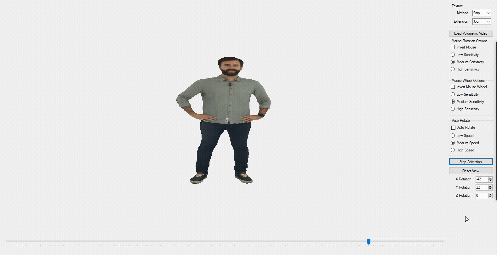

## `About`
Volumetric video (also known as free-viewpoint video) is a technology that allows capturing videos using multiple synchronized cameras, generating 3D models, and enabling to view it from any chosen viewpoint. 3D view operations (Rotation, Auto-Rotate, Zoom, etc.)

Toolkit: OpenTK, C#, Git

## `Examples`

## `References`
[1] https://v-sense.scss.tcd.ie/research/6dof/quality-assessment-for-fvv-compression/

[2] E. Zerman, C. Ozcinar, P. Gao, A. Smolic. “Textured mesh vs coloured point cloud: A subjective study for volumetric video compression.” Twelfth International Conference on Quality of Multimedia Experience (QoMEX), Athlone, Ireland, May 2020.

